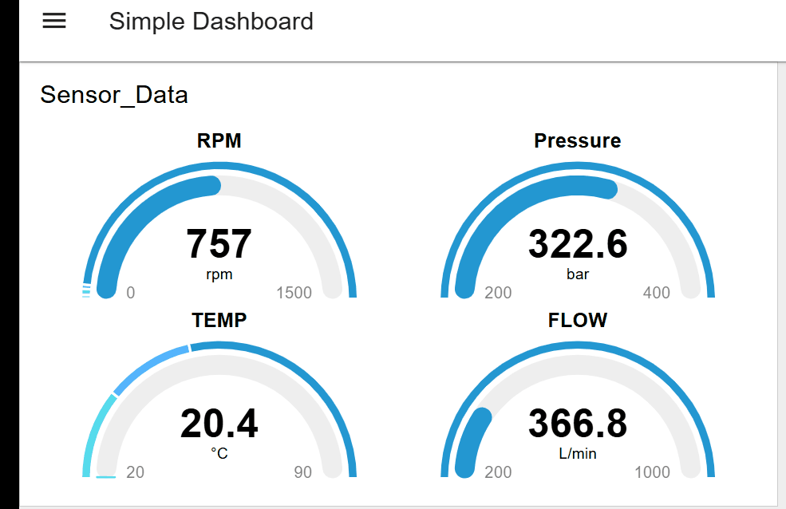

# Industrial IoT Simulation -CODESYS-NodeRED-OPCUA 🏭

A real-time factory simulation bridging **CODESYS SoftPLC** and **Node-RED**.

## 🎥 Demo

## 🛠️ Tech Stack
* **Source:** CODESYS Control Win V3 (IEC 61131-3 Structured Text)
* **Protocol:** OPC UA
* **Visualization:** Node-RED Dashboard 2.0 (Dockerized)

## ⚙️ How it Works
1.  **PLC Logic:** Generates simulated sensor data (RPM, Pressure, Flow, Temp) using sine wave algorithms in Structured Text.
2.  **Communication:** Variables are exposed via the CODESYS Symbol Configuration to the local OPC UA Server.
3.  **Visualization:** Node-RED subscribes to the OPC UA topics and visualizes the data on live gauges and charts.

## 🚀 How to Run
1.  Open the file in `/plc` using CODESYS.
2.  Login and Start the SoftPLC.
3.  Import `flows.json` into Node-RED.
4.  Update the OPC UA Endpoint in Node-RED with your local IP.
